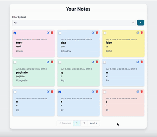

# Another Task App

**Prerequisites for local setup:**

- Docker
- PHP 8.2
- Any text editor

**Instructions:**

- Clone the project `git clone git@github.com:einnar82/another-todo-api.git`
- Start the docker.
- Go to the project folder and run `composer install`
- Copy the `.env.example` file and create a new `.env` file.
- In your terminal type `./vendor/bin/sail up -d`
- The project is running at `localhost:80`.
- Run the tests `./vendor/bin/sail test`

**Git commands used for this project.**

- `git add`
- `git commit`
- `git push`
- `git pull`
- `git merge`
- `git log`

**Screenshots:**

